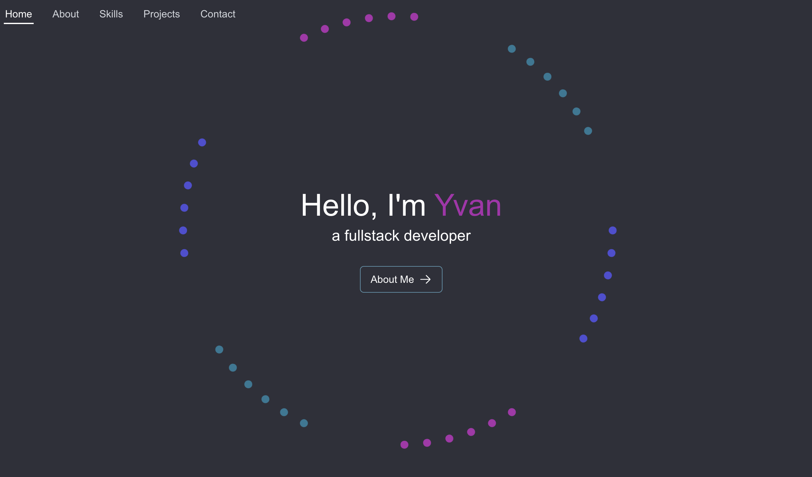

# ✨ plutopulp.com

My portfolio website.



## 🚀 Out in the Wild

Residing at [plutopulp.com](https://plutopulp.com).

## 🎭 The Premise

Wanting to have a bit of fun with CSS animations and the like.

Features include:

- **CSS keyframes** spiral-like animations
- **Responsive design** that shouldn't fall apart too much
- **Project showcases** with image slider and movies
- **Skills section** with some sequence animations
- **Contact form** that actually sends emails. Revolutionary stuff!

## 🛠️ Technical Decisions

Some technologies that were used in the making of this website:

- **Framework**: [Next.js 15](https://nextjs.org/)
- **Styling**: [Tailwind CSS](https://tailwindcss.com/) – Bit of styled-components thrown in there for the spiral-animation stuff, was way easier and clearer
- **Animation**: [Framer Motion](https://www.framer.com/motion/) – For transitions.
- **Components**: Custom-built, with occasional help from Headless UI
- **Deployment**: Vercel – Quick and easy

## 🔧 Development Setup

### Requirements

You'll need:

- [Node.js](https://nodejs.org/) (v18.0+)
- [Yarn](https://yarnpkg.com/) or npm if you prefer

### Environment Variables

If you want email functionality to work for the contact form, you'll need to add some emailjs related environment variables.
Create a `.env.local` file in the `web` directory with the following variables:

```env
# EmailJS configuration
NEXT_PUBLIC_EMAILJS_SERVICE_ID=your_service_id
NEXT_PUBLIC_EMAILJS_TEMPLATE_ID=your_template_id
NEXT_PUBLIC_EMAILJS_PUBLIC_KEY=your_public_key
```

### Option 1: Standard Setup

```bash
# Install dependencies
make install

# Start server
make dev-local
```

The site will appear at [localhost:3000](http://localhost:3000).

### Option 2: Docker Approach

For the container enthusiasts:

```bash
# Development environment
make dev

# Production-like environment
make dev-prod

# View logs of running container
make logs

# Access container shell
make shell
```

Default port is 3000. To use a different one:

```bash
make dev PORT=3001
```

### Common Commands

```bash
# Production build
make build

# Check code style
make lint

# Clean up
make clean
```

## 📁 Project Structure

```
plutopulp.com/
├── web/                   # Frontend application
│   ├── src/
│   │   ├── app/           # Next.js app router and pages
│   │   ├── components/    # UI components
│   │   │   ├── about/     # About section components
│   │   │   ├── contact/   # Contact form components
│   │   │   ├── landing/   # Landing page components
│   │   │   ├── layout/    # Layout components (navbar, footer)
│   │   │   ├── projects/  # Project showcase components
│   │   │   ├── sections/  # Main page sections
│   │   │   ├── skills/    # Skills visualization
│   │   │   └── ui/        # Reusable UI components
│   │   ├── contexts/      # React contexts
│   │   ├── hooks/         # Custom React hooks
│   │   ├── lib/           # Utilities and data
│   │   │   ├── projects.ts # Project data
│   │   │   ├── skills.ts   # Skills data
│   │   │   └── utils.ts    # Helper functions
│   │   └── types/         # TypeScript definitions
│   ├── public/            # Static assets
│   │   ├── images/        # Image assets
│   │   └── icons/         # Icon assets
│   └── ...                # Configuration files
├── docker/                # Container setup
│   ├── Dockerfile
│   └── docker-compose.yml
└── Makefile               # Command shortcuts
```

## 🌐 Deployment

Hosted on Vercel. Commits to main branch trigger automatic deployments.

## 🔍 Customization

Content can be modified in:

- `src/lib/projects.ts` - Project information
- `src/lib/skills.ts` - Skills and technologies

## 📄 License

Feel free to use this as inspiration for your own portfolio.

## 👤 Author

- Built by Yvan Buggy ([@plutopulp](https://github.com/plutopulp))
